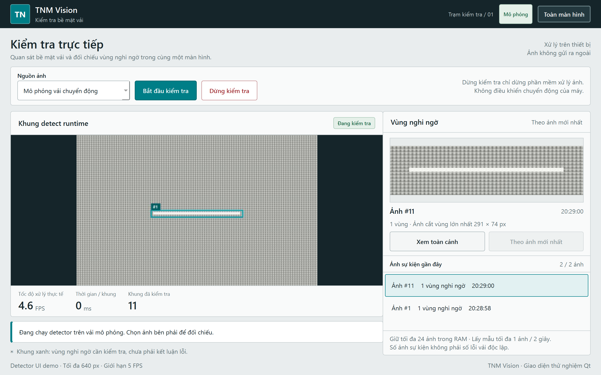

# UI-machine

Giao diện HMI Qt Widgets cho TNM Vision, tách riêng khỏi thuật toán detect và adapter camera.



## Chạy bản mô phỏng

```bash
python -m pip install -e .
ui-machine --autostart demo
```

Chế độ mô phỏng nằm hoàn toàn trong repo này, dùng để duyệt giao diện và kiểm tra thao tác
khi chưa có camera hoặc dịch vụ detect.

## Nối với TNM Vision runtime

Khởi động backend TNM Vision và lấy URL có token mà backend in ra, sau đó chạy:

```bash
ui-machine --api-url http://127.0.0.1:PORT/TOKEN/ --autostart camera --fullscreen
```

Giao diện sử dụng hợp đồng HTTP hiện có:

- `GET api/state`
- `GET image/frame/{id}`
- `GET image/crop/{id}`
- `GET image/context/{id}`
- `POST api/start`
- `POST api/stop`

## Lệnh thường dùng

```bash
ui-machine --autostart demo --fps 5 --width 640
ui-machine --fullscreen --autostart demo
ui-machine --help
```

`F11` bật hoặc tắt toàn màn hình. `Escape` rời toàn màn hình.

Ứng dụng chỉ điều khiển phiên xử lý ảnh. Nó không phát lệnh điều khiển chuyển động của máy.
