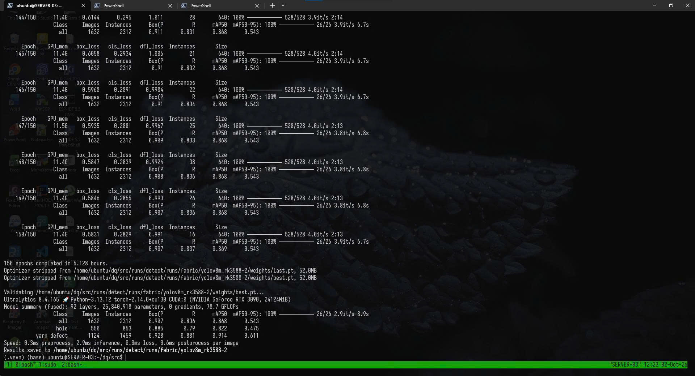
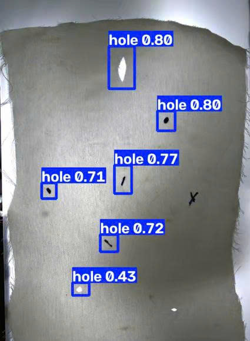

# Mô hình phát hiện khuyết tật vải bằng YOLOv8m

Thư mục này lưu lại kết quả huấn luyện và thử nghiệm mô hình **YOLOv8m** cho bài toán phát hiện khuyết tật trên bề mặt vải. Bộ dữ liệu trong kết quả đánh giá gồm hai nhãn:

- `hole`: lỗ thủng trên vải.
- `yarn defect`: lỗi liên quan đến sợi vải.

## 1. Kết quả huấn luyện

Ảnh `trainning.jpg` chụp màn hình khi quá trình huấn luyện hoàn thành **150 epoch**. Thời gian huấn luyện được ghi nhận là khoảng **6,128 giờ**. Mô hình sau huấn luyện có **92 lớp**, khoảng **25,84 triệu tham số** và yêu cầu **78,7 GFLOPs**.

Kết quả đánh giá từ ảnh:

| Lớp | Số ảnh | Số đối tượng | Precision | Recall | mAP@50 | mAP@50–95 |
|---|---:|---:|---:|---:|---:|---:|
| Tất cả (`all`) | 1.632 | 2.312 | 0,907 | 0,836 | 0,868 | 0,543 |
| `hole` | 550 | 853 | 0,885 | 0,790 | 0,822 | 0,475 |
| `yarn defect` | 1.124 | 1.459 | 0,928 | 0,881 | 0,914 | 0,611 |

Ý nghĩa các chỉ số:

- **Precision**: tỷ lệ dự đoán khuyết tật đúng trong tổng số dự đoán của mô hình.
- **Recall**: khả năng tìm được các khuyết tật thực sự có trong ảnh.
- **mAP@50**: độ chính xác trung bình khi ngưỡng IoU bằng 0,5.
- **mAP@50–95**: độ chính xác trung bình trên nhiều ngưỡng IoU từ 0,5 đến 0,95; đây là tiêu chí khắt khe hơn.

Kết quả cho thấy mô hình nhận diện lớp `yarn defect` tốt hơn lớp `hole`. Chỉ số tổng thể **mAP@50 = 0,868** cho thấy mô hình đã học được tương đối tốt đặc trưng của hai loại khuyết tật, trong khi **mAP@50–95 = 0,543** cho thấy vị trí hoặc kích thước bounding box vẫn còn khả năng cải thiện ở các yêu cầu IoU cao.

## 2. Kết quả phát hiện lỗ thủng

Ảnh `detected.jpg` minh họa kết quả suy luận của mô hình trên một mẫu vải. Mô hình phát hiện **6 vùng khuyết tật** thuộc lớp `hole`, với độ tin cậy lần lượt là:

- 0,80
- 0,80
- 0,77
- 0,72
- 0,71
- 0,43

Mỗi khung màu xanh biểu diễn vị trí mà mô hình cho là có lỗ thủng. Con số bên cạnh nhãn `hole` là **độ tin cậy của riêng dự đoán đó**, không phải độ chính xác tổng thể của mô hình. Dự đoán có confidence **0,43** là trường hợp ít chắc chắn nhất và nên được xem xét khi lựa chọn ngưỡng confidence để triển khai thực tế.

## Nhận xét

YOLOv8m tạo sự cân bằng giữa độ chính xác và tốc độ, phù hợp với bài toán kiểm tra lỗi vải bằng thị giác máy tính. Để cải thiện mô hình, có thể bổ sung dữ liệu cho lớp `hole`, tăng số mẫu khó và mẫu có kích thước khuyết tật nhỏ, đồng thời thử điều chỉnh ngưỡng confidence dựa trên yêu cầu bỏ sót hoặc cảnh báo nhầm của hệ thống thực tế.
